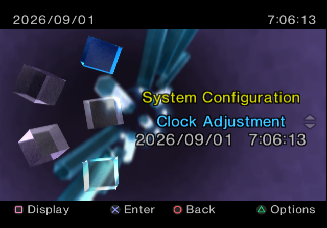
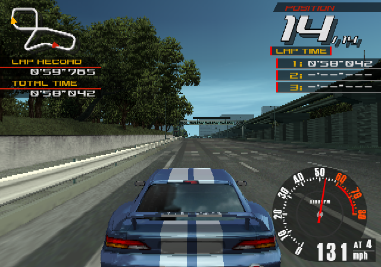

# libgpu2

Source reconstruction of Sony's `libgpu2` Ver1.12.0 — the 1998
behavioural model of the PlayStation 2 Graphics Synthesizer that
rendered for the SKY Emotion Engine simulator.

The original library survives as 23 unstripped ELF32/i386 objects,
built with a privately modified g++ 2.7.2.3.  This repository
reconstructs all 23 as buildable C++ and verifies the result against
the original objects, the original model's output, and real PS2
hardware.

> This repository contains reconstructed source, tests, tooling and
> documentation.  Sony binaries, SDK files and game dump data are not
> distributed here.

<p align="center">
  
  
</p>

*The PS2 system menu and Ridge Racer V, replayed from PCSX2 GS dumps
through the reconstruction — a build with zero 1998 objects in the
link — bit-identical to the original model's output.*

## What is GPU2?

Before final PlayStation 2 development hardware was widely available,
Cygnus' SKY simulator modeled the Emotion Engine side of the machine —
CPU, DMA, VIF, VUs and GIF — and handed Graphics Synthesizer register
writes to Sony's `libgpu2` through a very small API:

```c
GS_InitSim();
GS_OpenSim(title, width, height, disp_on, field);
GS_PutPort(reg, data);        /* the GIF-side register stream */
GS_PutCtlPort(reg, data);     /* the privileged side */
GS_SaveImage(filename);
GS_CloseSim();
```

Behind that interface is a complete software model of the GS, written
as one C++ class per pipeline stage: primitive setup, rasterization,
texturing, tests and blending, the 4 MB local memory with its
page/block addressing, and the PCRTC display path — with an X11 window
as the video output.  Two members of the archive turn out to be Sony's
own debugging equipment: a Tcl-style register console (`gpu2reg`) and a
tap layer that logs every pipeline stage's records to files
(`gpu2vec`).

## Status

- **All 23 archive members are reconstructed.**  `OWN=1 tools/build.sh`
  links the replay harness against an archive containing zero 1998
  objects.
- The reconstruction replays the GS dump corpus — the PS2 system menu
  and **Ridge Racer V** — with VRAM output **bit-identical** to the
  original model, and passes the behaviour suite with 0 failures.
- Byte-level matching against the original objects is far along: many
  objects are whole-file or near-whole identical, symbol tables and
  relocation sets match throughout, and the remaining deltas are pinned
  to two identified modifications in Sony's private compiler (one
  reproduced, one half-cracked).  Live scoreboard:
  [doc/MATCHING.md](doc/MATCHING.md).
- Checked against real silicon: replaying the same streams on a
  DTL-T10000 devkit, 51 of 85 captured frames are bit-identical across
  all 4 MB of VRAM; the rest differ at ±1 LSB, largely within the
  hardware's own run-to-run nondeterminism.
  Details: [doc/HARDWARE.md](doc/HARDWARE.md).

## Architecture

The recovered class structure is a direct image of the GS pipeline,
one stage handing its state to the next through a virtual `Put`:

```text
GS register stream (GIF)
      |
     Pre1      register decode, vertex queue and kick
      |
     Pre3      primitive assembly
      |
    PCalc      setup engine: slopes, subpixel, AA coverage
      |
     DDA       2x4-pixel stamp walker, per-channel interpolation
      |
     TXM       texturing: LOD, CLUT lookup, filtering, fog
      |
    MemIF      scissor/alpha/Z tests, blending, dithering, formats
      |
   Memory      4 MB local memory: pages, blocks, columns, transfers
```

The display side is modeled separately: PCRTC circuit merge → `Xif` →
an X11 window.  The per-stage `Put` boundaries are natural tap points —
Sony's own `gpu2vec` instruments exactly these.

Layout evidence: [doc/STRUCTS.md](doc/STRUCTS.md) · 1998 C++ ABI:
[doc/ABI.md](doc/ABI.md) · compiler archaeology:
[doc/compiler.md](doc/compiler.md)

## Watching it render

The model consumes raw GIF-stream traffic.  The easiest source is a
PCSX2 GS dump (a `.gs`/`.gs.zst` file holding the VRAM seed, register
state and one or more frames of GIF stream).

**The PNG path** — one command, no X11 involved:

```sh
tools/gs2png dump.gs              # -> dumpname/snap000_end_fb1.png
tools/gs2png dump.gs --vsync      # a PNG per frame
```

This unpacks the dump, builds the harness on first use, replays the
stream through the model, works out what was on screen from the dump's
privileged registers, and renders it — with PCSX2's own render of the
same frame beside it as `shot.png` for comparison.

**The X11 path** — watch the model display the frame live, through its
own 1998 display code (the same window Sony watched it through):

```sh
tools/build.sh                    # build the harness once
tools/gsprep.py dump.gs mydump    # unpack the dump once
tools/gsreplay mydump -w          # window opens, refreshed each vsync
```

Expect seconds per frame on 3D content: every pixel goes through the
full behavioural pipeline in software — that is the point.  `-v` logs
every register write, `-s`/`-e` snapshot or stop at chosen
vsyncs/transfers/primitives (see the header of `tools/gsreplay.c`).

Prerequisites: a 32-bit userland to link against (Void:
`xbps-install glibc-devel-32bit libX11-32bit`), clang (cross-compiles
the harness to i386; the model itself is built by the bundled era g++),
python3 + Pillow for the PNG side.

## Who is this for?

- **PS2 emulator developers** — a vendor-written, behaviour-level
  ground truth for GS rasterization, cross-checked against real
  silicon: fixed-point setup, stamp traversal, texture sampling,
  blending and dithering rules that register-level docs do not pin
  down.
- **Graphics and console history** — how Sony modeled the GS in
  software during the PS2's development, complete with their own
  debugging tools.
- **PS2 developers** — together with the SKY simulator this is a
  path to running EE-side code against a 1998-authentic software PS2;
  making that practical needs more work on the SKY side and is an
  active goal here.

## Repository map

```text
src/       reconstructed C++ source, one file per original object
include/   reconstructed headers
test/      differential and behavioural tests, per object
tools/     replay harness, renderers, era compiler, hardware suite
doc/       MATCHING.md   per-object scoreboard + byte-matching lessons
           RECONSTRUCTION.md  how the source was produced and verified
           HARDWARE.md   model vs real GS silicon
           ABI.md / STRUCTS.md / compiler.md   the underlying evidence
           notes/        a write-up per object

orig/      [not committed]  the 1998 objects, used locally for verification
dumps/     [not committed]  GS dump corpus used as test input
out/       [not committed]  replay/render output
```

## Verification, in one paragraph

Correct-looking output is not considered sufficient.  Every
reconstructed object passed three gates: a differential test linking it
into one binary with the original and comparing every observable over
millions of calls; an oracle replay demanding bit-identical VRAM
against the original model on real game streams; and byte-level
comparison of the era-compiler build against the 1998 object — sections,
relocations, symbol tables, and .text function by function, with the
residuals attributed to Sony's compiler modifications and documented.
The method is in [doc/RECONSTRUCTION.md](doc/RECONSTRUCTION.md), the
results in [doc/MATCHING.md](doc/MATCHING.md).

## Future work

- A native amd64 build of the model.
- An interactive GS debugger — live framebuffer, register watch,
  primitive stepping — built on the same stage boundaries Sony's
  `gpu2reg` console and `gpu2vec` taps already use.
- Finishing the second era-compiler patch, which would close most of
  the remaining byte-match residuals.
